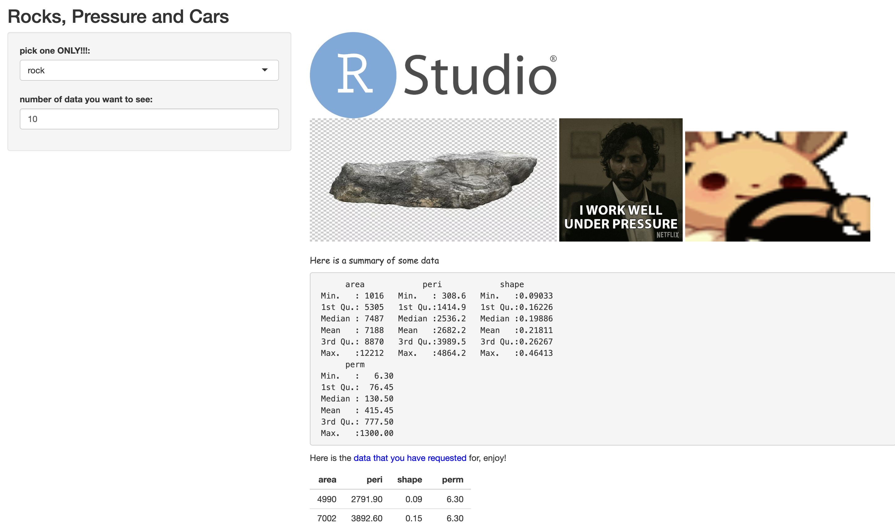
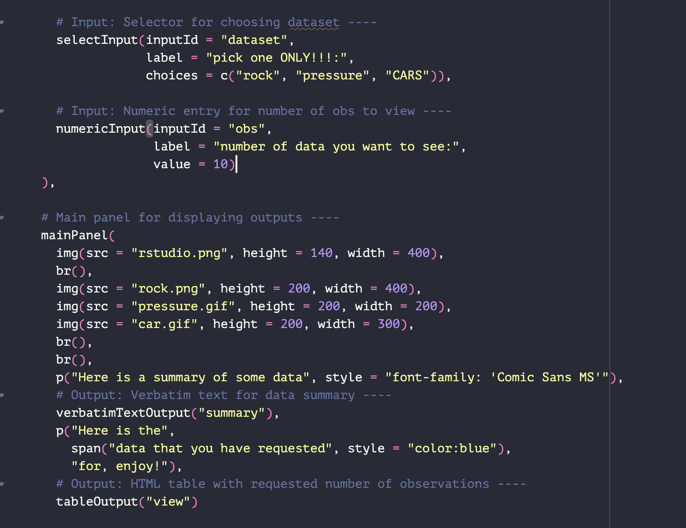

```{r setup, include=FALSE}
knitr::opts_chunk$set(echo = TRUE)
```

## Questions
<br>

#### My attempt at playing around!

**kinda fun but many more to explore**

```{r, eval= T,echo= F}
 
 
```
i added in some photos, and i was able to add gifs too! which is a really nice touch.

i also learned that in order to put a line break, you have to insert **TWO 'br()'s** for it to work...

i also learned the div function, and also how to change the labels on each of the input areas 

<br>
<br>

